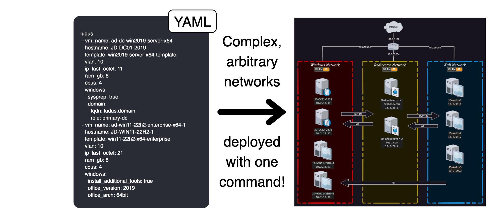

Avoir son lab, perso ou au travail est la promesse de la progression. De pouvoir casser et recommencer, s’entraîner, développer, tester des attaques et des outils.

Pourtant, la mise en place d’un lab peut être longue et fastidieuse, il faut parfois plusieurs mois pour atteindre un résultat satisfaisant qui sera dans tous les cas difficile à reproduire. Ludus permet de pallier ce problème : en effet cet outil basé sur Ansible permet de déployer relativement facilement des labs complexes sur des hyperviseurs.



Ci-dessus la promesse de Ludus, transformer un “simple” fichier de configuration en un lab démarré et exploitable.

Ici j’explique quelques rudiments du fonctionnement de Ludus et vous montre comment déployer votre propre lab. Pour cela, je vous propose de partir sur un environnement avec Proxmox.

A la fin de cet article, nous aurons compris comment fonctionne Ludus et déployé notre premier range qui sera ainsi :


# Prérequis

### Hardware

Au niveau hardware je dispose d’une tour dédiée et hébergée chez un copain avec le setup suivant :

- AMD Ryzen 7 3700X 8-Core Processor
- NVIDIA Corporation TU104 [GeForce RTX 2070 SUPER] ( pour faire un peu de ML )
- 94 Gi de RAM
- 2 To de disque

La tour susnommée a déjà servi pour des projets plus ou moins foireux ces dernières années mais reste un compagnon fidèle. On espère qu’elle suffira dans cette aventure. Notez que pour la plupart des labs, un setup plus restreint peut également être suffisant. On pourra déployer notre range de trois machines à partir de 16go de RAM.

### Mise en place de l’OS

Un rappel rapide sur les deux grandes familles d'hyperviseurs :

- **Le Type 2 (Hosted) :** C'est un logiciel qui s'installe sur votre OS habituel (comme VirtualBox sur Windows). C'est pratique pour tester, mais vous perdez en performance car l'OS hôte consomme déjà beaucoup de ressources.
- **Le Type 1 (Bare Metal) :** C'est un système d'exploitation à part entière qui s'installe directement sur le matériel (ex: Proxmox, ESXi). C'est la solution "pro" : il n'y a aucune couche inutile entre vos VMs et votre processeur.

Pour ce projet, nous avons opté pour **Proxmox**, un Type 1 basé sur Debian. Il s’agit d’un hyperviseur assez fiable et open source qui bénéficie d’une bonne communauté. Il est tout à fait suffisant pour des projets comme celui-ci.

Afin d’installer Proxmox, le guide suivant est assez détaillé sur le sujet : [https://pve.Proxmox.com/wiki/Installation](https://pve.proxmox.com/wiki/Installation). En somme cela ressemble à n’importe quelle installation de système d’exploitation sauf que cette fois il s’agit d’installer notre hyperviseur de type 1.


*Exemple d’un promox installé*

- Pour plus de sécurité, j’accède à mon range grâce à wireguard, qui se connecte à la box derrière laquelle est hébergée la tour. De manière générale il est peu souhaitable d’exposer son interface de gestion de Proxmox sur Internet.

## Ludus (Le "Game Changer")

La mise en place d'un environnement Active Directory complet avec des clients, un contrôleur de domaine, des outils de monitoring et des configurations réseau cohérentes peut prendre des jours ( ~~et être très chiant~~). C’est là que **Ludus** va nous aider.

Ludus est un outil de déploiement d'infrastructure (Infrastructure-as-Code) spécialement conçu pour créer des lab. Ludus va commander à Proxmox de créer, configurer et lier vos machines entre elles en fonction d’architectures que nous aurons préconfigurées.

**Ses points forts :**

- **Rapidité :** On passe de plusieurs jours de configuration manuelle à quelques minutes (le temps de la construction et du déploiement des images).
- **Reproductibilité :** Si vous cassez tout (ce qui peut régulièrement arriver), vous pouvez raser le lab et le reconstruire à l'identique d'une seule commande.
- **Prêt pour les test :** Il facilite l'intégration d'outils comme Ghostwriter, la suite Elastic pour le monitoring, ou des environnements AD déjà durcis ou vulnérables selon vos besoins

### Architecture de Ludus

De manière schématique voici comment est fait un range ludus :


Les template sont des VM-types précontruits par Ludus quand on fait `ludus template build` . Les VM sont des clones liés à leur template d’origine. Clone lié signifie que le disque de la VM ne stocke que la différence avec le template d’origine ce qui sauvegarde beaucoup d’espace. 

### Le réseau

Enfin on peut remarquer la VM Network en rouge, celle-ci est chargée de faire communiquer toutes les VM entre elles. Par défaut aucune segmentation réseau n’est appliquée. Cependant dans la configuration, on choisira pour chaque machine un VLAN et chaque machine de même VLAN sera sur la même interface réseau virtuelle. Voici un schéma simplifié du fonctionnement du réseau dans ludus :


Ainsi les VM sur le même VLAN peuvent communiquer entre elles sans passer par la VM network ( appelée router dans ludus ) mais pour aller du VLAN 1 au VLAN 2, on passera nécessairement par la VM Network.

- A noter que l’ID de VLAN est une abstraction qui concerne uniquement l’hyperviseur pour pouvoir segmenter les réseaux de mêmes adresses. Pour les machines virtuelles cela est complètement transparent.

### Déploiement des rôles

Pour finir sur l’architecture de ludus il nous faut parler des rôles Ansible. En Ansible, un rôle est une tâche reproductible et paramétrable via ses variables pour atteindre un état. Ex : un serveur web avec apache déployé. En utilisant un ensemble de rôles, ludus va faire des tâches de configuration sur notre hyperviseur :

- déploiement des VM
- démarrage des VM
- installation et configuration du réseau

Une fois cela fait on peut utiliser les rôles prédéfinis dans ludus ou ajouter les nôtres pour configurer notre range.  

### Installation de Ludus : La simplicité avant tout

Voici comment installer Ludus sur notre noeud Proxmox :

**Le Script magique** 

L'installation se fait via une simple ligne de commande fournie par la documentation officielle :
`curl -sS https://install.ludus.cloud | sudo bash` . L’installation se fera dans `/opt/ludus` et régulièrement vous pourrez lancer la commande `ludus-install-status` pour vérifier où  en est l’installation.

**Création d’un utilisateur**

Afin d’utiliser Proxmox, vous devrez créer au moins un utilisateur. Si vous voulez mettre en place votre installation pour plusieurs personnes vous pourrez également en ajouter de nouveaux par la suite.

Récupérez la clef d’API ainsi :

```jsx
root@pve:/opt/ludus# ludus-install-status
Ludus install completed successfully
Root API key: ROOT.YYY-XXXXXXXXX
```

Ainsi que l’indique la documentation vous pouvez créer votre premier utilisateur ainsi :

```jsx
LUDUS_API_KEY='ROOT.YYY-XXXXXXXXX' \
 ludus user add --name "Mon Utilisateur" --userid MONID --admin --url https://127.0.0.1:8081
+--------+------------------+-------+---------------------------------------------+
| USERID | Proxmox USERNAME | ADMIN |                   API KEY                   |
+--------+------------------+-------+---------------------------------------------+
| JD     | mon-utilisateur         | true  | MONID._ZZZZZZ |
+--------+------------------+-------+---------------------------------------------+
```

Notez bien votre nouvelle clef d’API renvoyée par la commande. Vous pouvez même la sauvegarder dans votre bashrc pour l’utiliser plus tard :

```jsx
echo export LUDUS_API_KEY=MONID._ZZZZZZ >> ~/.bashrc
source ~/.bashrc
```

Ainsi, votre nouvelle clef d’API vient remplacer la clef d’API root qui ne permet pas à l’utilisateur courant de créer des template, VM, etc…

### Construction des templates

Les template sont les modèles qui vont servir à construire vos VM, vous pouvez les lister ainsi :

```jsx
ludus template list
+------------------------------------+-------+
|              TEMPLATE              | BUILT |
+------------------------------------+-------+
| debian-11-x64-server-template      | FALSE  |
| debian-12-x64-server-template      | FALSE  |
| kali-x64-desktop-template          | FALSE  |
| win11-22h2-x64-enterprise-template | FALSE  |
| win2022-server-x64-template        | FALSE  |
+------------------------------------+-------+
```

Au niveau de Proxmox, chaque VM se comportera comme un clone lié à un template, c’est à dire qu’elle sera commune en tout point avec la VM template jusqu’à ce qu’on la modifie pour la personnaliser à nos besoins.

Maintenant on peut lancer :

```jsx
ludus templates build
```

Vous pouvez maintenant aller prendre un café, puis regarder Titanic et reprendre un autre café.

### Mise en place d’un premier range

Chaque utilisateur a son propre range, nommé en fonction de l’id de l’utilisateur. De cette manière, si vous voulez gérer plusieurs range, créer plusieurs utilisateurs est la façon la plus ludus-friendly.

A tout moment vous pouvez faire :

```jsx
# ludus range status
+---------+---------------+------------------+---------------+-------------------+-----------------+
| USER ID | RANGE NETWORK | LAST DEPLOYMENT  | NUMBER OF VMS | DEPLOYMENT STATUS | TESTING ENABLED |
+---------+---------------+------------------+---------------+-------------------+-----------------+
|  admin  |  10.2.0.0/16  | 2025-12-26 16:53 |       0       |     DESTROYED     |      FALSE      |
+---------+---------------+------------------+---------------+-------------------+-----------------+
+------------+---------+-------+----+
| Proxmox ID | VM NAME | POWER | IP |
+------------+---------+-------+----+
+------------+---------+-------+----+
```

Ci-dessus, vous pouvez voir que je viens de tester un nouvel environnement puis que je l’ai détruit.

Maintenant créons notre premier environnement :

```jsx
# cd /opt/ludus
# mkdir ranges 
# cd ranges
# vim first-range.yml
```

Maintenant copiez-collez la configuration suivante :

```jsx
ludus:
  - vm_name: "{{ range_id }}-ad-dc-win2019-server-x64" # Le nom de la VM dans Proxmox. Vous pouvez utiliser la variable `{{ range_id }}` qui correspond à l'ID de votre range (ex: JS)
    hostname: "{{ range_id }}-DC01-2019"   # Le nom d'hôte de la VM. Note : les noms d'hôte Windows sont limités à 15 caractères à cause de NETBIOS
    template: win2022-server-x64-template  # Le template qui servira de base à cette VM (`ludus templates list` pour voir la liste)
    vlan: 10            # Le VLAN de cette VM. Ce nombre sera le troisième octet de l'IP et doit être compris entre 2 et 255
    ip_last_octet: 11   # Le dernier octet de l'IP. Doit être unique dans le VLAN.
    force_ip: true      # Si activé, l'IP définie sera forcée même si qemu-guest-agent ne répond pas (utile pour l'EDR ou l'anti-sandbox)
    ram_gb: 8           # Quantité de RAM pour cette VM
    cpus: 4             # Nombre de cœurs CPU alloués (peut dépasser le nombre de cœurs physiques de l'hôte)
    windows:            # Cette clé est obligatoire pour les VMs Windows - les sous-clés sont optionnelles
      sysprep: false    # Mettre à true pour lancer un sysprep avant toute autre tâche. Par défaut : false
      gpos:
        - disable_defender   # Crée et lie une GPO qui désactive Windows Defender sur toutes les machines du domaine
        - anon_share_access # Active l'accès anonyme aux partages SMB (utile pour `ludus range deploy -t share`)

    domain:               # Défini cette machine comme membre d'un domaine
      fqdn: ludus.network # Le FQDN du domaine
      role: primary-dc    # Rôle dans le domaine (primary-dc|alt-dc|member)
    dns_rewrites:           # Ajoute des enregistrements A dans le DNS du range pour cette VM
      - example.com         # Réécrit seulement ce domaine
      - '*.example.com'     # Réécrit tous les sous-domaines mais pas le domaine principal
    unmanaged: false        # True pour les VMs sans qemu-guest-agent (config IP manuelle requise). Par défaut : false
    primary_dns_server: 1.1.1.1   # DNS primaire. Par défaut : 10.range.vlan.254 (le routeur)
    secondary_dns_server: 8.8.8.8 # DNS secondaire

  - vm_name: "{{ range_id }}-ad-win11-22h2-enterprise-x64-1"
    hostname: "{{ range_id }}-WIN11-22H2-1"
    template: win11-22h2-x64-enterprise-template
    vlan: 10
    ip_last_octet: 21
    ram_gb: 8
    cpus: 4
    windows:
      sysprep: false
      chocolatey_ignore_checksums: false # Ignore les erreurs de checksum pour l'installation de paquets Chocolatey. Par défaut : false
      chocolatey_packages:
        - vscodium                # Liste de paquets Chocolatey à installer. Par défaut : aucun
      office_version: 2019        # Version de MS Office (2013|2016|2019|2021). Par défaut : non installé
      office_arch: 64bit          # Architecture d'Office (64bit|32bit)
      visual_studio_version: 2019 # Version de Visual Studio (Community). Par défaut : non installé
      autologon_user: myuser      # Utilisateur pour l'auto-logon. Par défaut : localuser ou ad_domain_user
      autologon_password: mypass  # Mot de passe pour l'auto-logon.
    domain:
      fqdn: ludus.network
      role: member

  - vm_name: "{{ range_id }}-kali"
    hostname: "{{ range_id }}-kali"
    template: kali-x64-desktop-template
    vlan: 99
    ip_last_octet: 1
    ram_gb: 8
    cpus: 4
    linux:
      packages:
        - curl
        - python3
    testing:
      snapshot: false
      block_internet: false
 
 defaults:
  snapshot_with_RAM: true                  # Capture l'état de la RAM pour revenir à une VM en cours d'exécution
  stale_hours: 0                           # Heures avant qu'un snapshot ne soit considéré comme obsolète
  ad_domain_functional_level: Win2012R2    # Niveau fonctionnel du domaine (Win2003 à Win2025)
  ad_forest_functional_level: Win2012R2    # Niveau fonctionnel de la forêt
  ad_domain_admin: domainadmin              # Nom de l'admin du domaine
  ad_domain_admin_password: password        # MDP de l'admin du domaine
  ad_domain_user: domainuser                # Nom de l'utilisateur du domaine
  ad_domain_user_password: password         # MDP de l'utilisateur du domaine
  ad_domain_safe_mode_password: password    # MDP du mode sans échec (DSRM)
  timezone: Europe/Paris                   # Fuseau horaire (format TZ database)
  enable_dynamic_wallpaper: true           # Active le fond d'écran dynamique (rouge/vert) pour Windows
```

Ci-dessus nous créons un range extrêmement basique avec un AD, une workstation et une machine virtuelle kali. Nous définissons également un domaine : [ludus.network](http://ludus.network) qui sera joint par notre workstation. 

Pour les habitués d’Ansible vous pourrez remarquer que le format est très proche et de fait, ludus est basé sur Ansible. Sinon je vous suggère de faire un tour sur la très bonne formation de Stéphane Robert sur le sujet : [https://blog.stephane-robert.info/docs/infra-as-code/gestion-de-configuration/Ansible](https://blog.stephane-robert.info/docs/infra-as-code/gestion-de-configuration/ansible/)

Au fur et à mesure, nous pourrons utiliser nos propres rôles dans la configuration de notre range.

On peut désormais appliquer notre configuration :

```jsx
# ludus range config set -f first-range.yml
```

Puis lancer le déploiement :

```jsx
# ludus range deploy
```

Enfin vous pourrez suivre le déploiement de votre lab au fur et à mesure :

```jsx
# ludus range logs -f
```

- En cas de besoin vous pourrez toujours supprimer le lab actuel avec la commande : `ludus range destroy`

## Utilisation de notre lab

Maintenant que notre lab est déployé on peut désormais y accéder sur notre hôte Proxmox :

Ex en double-clickant sur la vm `...-ad-win11-22h2-enterprise-x64-1` qui est notre contrôleur de domaine :


Remarquez que grâce à ludus, vous êtes automatiquement connecté à la VM.

Maintenant si on essaye de se connecter à la workstation :


Cette fois, la magie n’opère pas. En effet, dans les paramètres de la VM nous avions définit :

```jsx
		  autologon_user: myuser      # Utilisateur pour l'auto-logon. Par défaut : localuser ou ad_domain_user
      autologon_password: mypass  # Mot de passe pour l'auto-logon.
```

Cependant, cet utilisateur n’existe pas au niveau du domaine, il faut maintenant modifier les paramètres de notre range pour ajouter cet utilisateur automatiquement.

## Utiliser un rôle prédéfini

Dans la doc ludus vous trouverez [[https://docs.ludus.cloud/docs/roles](https://docs.ludus.cloud/docs/roles)](tous les rôles prédéfinis dans ludus) . Ici on va utiliser [https://github.com/Cyblex-Consulting/ludus-ad-content](https://github.com/Cyblex-Consulting/ludus-ad-content) pour ajouter automatiquement notre utilisateur au démarrage du lab. 

On commence par installer le rôle nécessaire :

```jsx
# cd /opt/ludus
# mkdir roles
# cd roles
# git clone https://github.com/Cyblex-Consulting/ludus-ad-content
# ludus Ansible role add -d ludus-ad-content/

ludus Ansible role add badsectorlabs.ludus_ad_content
```

Désormais, en suivant la documentation du rôle on peut modifier la VM AD ainsi :

```jsx
ludus:
  - vm_name: "{{ range_id }}-ad-dc-win2019-server-x64" # Le nom de la VM dans Proxmox. Vous pouvez utiliser la variable `{{ range_id }}` qui correspond à l'ID de votre range (ex: JS)
    hostname: "{{ range_id }}-DC01-2019"   # Le nom d'hôte de la VM. Note : les noms d'hôte Windows sont limités à 15 caractères à cause de NETBIOS
    template: win2022-server-x64-template  # Le template qui servira de base à cette VM (`ludus templates list` pour voir la liste)
    vlan: 10            # Le VLAN de cette VM. Ce nombre sera le troisième octet de l'IP et doit être compris entre 2 et 255
    ip_last_octet: 11   # Le dernier octet de l'IP. Doit être unique dans le VLAN.
    force_ip: true      # Si activé, l'IP définie sera forcée même si qemu-guest-agent ne répond pas (utile pour l'EDR ou l'anti-sandbox)
    ram_gb: 8           # Quantité de RAM pour cette VM
    cpus: 4             # Nombre de cœurs CPU alloués (peut dépasser le nombre de cœurs physiques de l'hôte)
    windows:            # Cette clé est obligatoire pour les VMs Windows - les sous-clés sont optionnelles
      sysprep: false    # Mettre à true pour lancer un sysprep avant toute autre tâche. Par défaut : false
      gpos:
        - disable_defender   # Crée et lie une GPO qui désactive Windows Defender sur toutes les machines du domaine
        - anon_share_access # Active l'accès anonyme aux partages SMB (utile pour `ludus range deploy -t share`)

    domain:               # Définit cette machine comme membre d'un domaine
      fqdn: ludus.network # Le FQDN du domaine
      role: primary-dc    # Rôle dans le domaine (primary-dc|alt-dc|member)
    roles:
      - ludus-ad-content
    role_vars:
      ludus_ad:
        ous:
          - name: France
            path: DC=ludus,DC=network
            description: French subsidiary
          - name: Germany
            path: DC=ludus,DC=network
            description: Germany subsidiary
        groups:
          - name: Sales France
            scope: global
            path: "OU=France,DC=ludus,DC=network"
            description: France Sales Department
          - name: Sales Germany
            scope: global
            path: "OU=Germany,DC=ludus,DC=network"
            description: Germany Sales Department
          - name: IT
            scope: global
            path: "DC=ludus,DC=network"
            description: IT Department
        users:
          - name: myuser
            firstname: My
            surname: User
            display_name: My User
            password: mypass
            path: "DC=ludus,DC=network"
            description: IT System Administrator
            groups:
              - Domain Users
              - IT
```

On ajoute donc plusieurs OU, groupes et notre fameux utilisateur.

On applique notre nouvelle conf :

```jsx
# ludus range config set -f first-range.yml
```

Afin de ne pas relancer tout le déploiement de notre range, on peut lancer la commande suivante pour déployer uniquement ce rôle :

```jsx
# ludus range deploy --only-roles ludus-ad-content
# ludus range logs -f # pour streamer le déploiement
```

Cette fois on peut se logger avec notre nouvel utilisateur sur la machine de travail :


## Ajouter des template à ludus

On pourrait avoir besoin d’ajouter des templates supplémentaires à notre range. On peut utiliser tous les templates disponibles ici : [https://gitlab.com/badsectorlabs/ludus/-/tree/main/templates?ref_type=heads](https://gitlab.com/badsectorlabs/ludus/-/tree/main/templates?ref_type=heads)

Pour en installer de nouveaux ( ex ubuntu ), on peut faire :

```jsx
git clone https://gitlab.com/badsectorlabs/ludus
cd ludus/templates
ludus templates add -d ubuntu-22.04-x64-server
```

On peut vérifier avec la commande `ludus template list`

Enfin, on peut construire notre nouveau template avec la commande :

```jsx
ludus template build
```

## Limites

Une des grandes limites de Ludus est son système de routage. En effet, bien que très simple pour commencer il pose un problème : on ne peut pas utiliser son propre firewall ni son propre router pour simuler son réseau. Or les équipements réseau sont des cibles de choix pour les attaquants et pour les défenseurs dans un réseau car tout passe par eux mais nous ne pouvons pourtant pas personnaliser cet aspect. Si cet article vous plaît je vous montrerai par la suite comment tordre le bras à Ludus avec Ansible pour résoudre ce problème.

## Mot de la fin

C’est tout pour ce blog en espérant qu’il vous sera utile ! Rendez-vous bientôt pour la suite du contenu ;)
